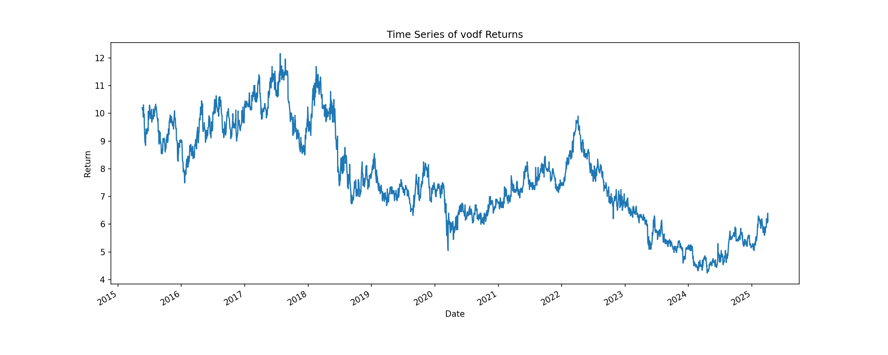

# Volatility Forecasting with GARCH Models

## Overview

This project builds a robust end-to-end pipeline for **volatility forecasting** using **GARCH (Generalized Autoregressive Conditional Heteroskedasticity)** models. It combines rigorous time series modeling with production-grade infrastructure, enabling real-time training and prediction of volatility forecasts for financial assets.

The focal point of the analysis is Vodafone Group's stock, but the system is designed to be **ticker-agnostic**, allowing it to model volatility for any publicly listed equity with available time series data.

---


Below is a Time Series plot of Vodafone Group, Frankfurt Returns.




## Features

-  **Automated Data Ingestion** from AlphaVantage
-  **GARCH(p, q) Modeling** using the `arch` library
-  **Volatility Forecasting** with customizable prediction horizon
-  **Model Persistence** via `joblib`
-  **SQLite-backed Data Management**
-  **FastAPI Service Layer** for remote training and prediction
-  **Interactive EDA** via Jupyter Notebook

---

## Architecture

```text
+-------------------+           +------------------+          +-----------------+
| AlphaVantage API  |  --->     | SQLite Database  |  --->    |   GARCH Model   |
+-------------------+           +------------------+          +--------+--------+
                                                                   |
                                                                   v
                                                         +---------------------+
                                                         | FastAPI REST Server |
                                                         +---------------------+
                                                                   |
                                                          +--------+---------+
                                                          | /fit   | /predict|
                                                          +--------+---------+
```

---

## Project Structure

```
.
├── config.py           # Environment & project settings
├── data.py             # Data ingestion and database I/O
├── model.py            # GARCH modeling and forecasting logic
├── main.py             # FastAPI app with /fit and /predict endpoints
├── notebook.ipynb      # EDA and offline forecasting in Jupyter
├── models/             # Serialized model files via joblib
├── images/             # Stored plots for documentation or visualizations
├── requirements.txt    # Dependencies
└── .env                # Secrets and API keys
```

---

## How It Works

### 1. Data Acquisition
- Data is fetched from the AlphaVantage API (`data.AlphaVantageAPI`).
- Time series is stored in a SQLite database under a table named after the ticker symbol.

### 2. Model Training
- The GARCH model is fit using `arch_model` from the `arch` package.
- Data is wrangled into percentage returns.
- AIC and BIC values are computed for model selection.

### 3. Forecasting
- Model forecasts the conditional volatility over a specified horizon.
- Forecast results are returned as a JSON dictionary with ISO 8601 timestamps.

### 4. Model Persistence
- Trained models are stored using `joblib` in a directory defined in `config.py`.
- The most recent model for a given ticker can be reloaded for predictions.

### 5. REST API
- `/fit`: Fit a new model with customizable (p, q) parameters and training size.
- `/predict`: Load the latest model and return volatility forecasts over `n` days.

---

## Example API Usage

### Fit a Model
```bash
curl -X POST http://localhost:8000/fit \
  -H "Content-Type: application/json" \
  -d '{
    "ticker": "VOD",
    "use_new_data": true,
    "n_observations": 500,
    "p": 1,
    "q": 1
  }'
```

### Predict Volatility
```bash
curl -X POST http://localhost:8000/predict \
  -H "Content-Type: application/json" \
  -d '{
    "ticker": "VOD",
    "n_days": 5
  }'
```

---

## Technical Highlights

### ✅ GARCH Modeling (arch library)
- Provides a statistically rigorous framework for volatility clustering.
- Outputs include AIC/BIC for model comparison.

### ✅ Clean Architecture
- Separation of concerns across data, model, API, and config modules.
- Easily extensible to other time series models (e.g., EGARCH, TARCH).

### ✅ Production-Ready API
- Built with FastAPI: async-ready, interactive Swagger UI, and schema validation via `pydantic`.
- Endpoints can be containerized and deployed for real-time inference.

### ✅ SQLite for Lightweight Persistence
- Easily portable, file-based DB solution.
- Makes this project fully self-contained.

---

## Setup Instructions

### 1. Install Requirements
```bash
pip install -r requirements.txt
```

### 2. Setup `.env` File
Create a `.env` file in the root directory:
```env
ALPHA_VANTAGE_API_KEY=your_api_key_here
DB_NAME=database.db
MODEL_DIRECTORY=models
```

### 3. Run the API
```bash
uvicorn main:app --reload
```

### 4. Run the Notebook
```bash
jupyter notebook
```
Open `notebook.ipynb` for EDA and offline testing.

---

## Future Extensions

-  **Model selection automation** via grid search over `(p, q)`.
-  **Scheduled retraining** with updated data.
-  **Dashboard** for real-time forecast visualization (e.g., Streamlit).
-  **Deep learning volatility models** as benchmarks.

---

## License

MIT License

---

## Author
Destiny Otto.

